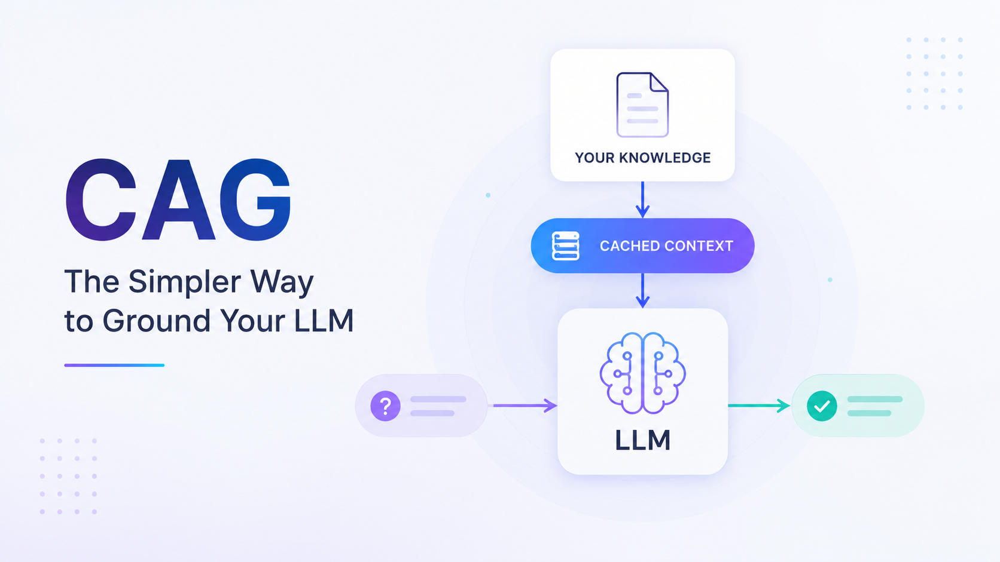

[⬅️ Back to Blogs](README.md)



# CAG: The Simpler Way to Ground Your LLM

If you've been building AI applications recently, you've probably come across **Retrieval-Augmented Generation (RAG)**. It has become the go-to way of giving LLMs access to external knowledge.

But RAG isn't the only option.

As context windows continue to grow, another approach is becoming increasingly practical: **Cache-Augmented Generation (CAG)**.

Before we begin, a small disclaimer. This article intentionally argues in CAG's favor. Think of it as a friendly debate where CAG finally gets a chance to speak while RAG takes a short coffee break.

---

## Why RAG Became So Popular

RAG solved a real problem.

Instead of expecting an LLM to know everything, we store information in a vector database. When a user asks a question, we retrieve the most relevant pieces and send them to the model.

A typical RAG pipeline looks like this:

```text
Query → Embed → Search → Rank → Retrieve → Generate
```

It's a proven approach and works really well, especially when your knowledge base is large or changes frequently.

The only downside is that every question has to go through this retrieval process before the model can generate an answer.

That means more infrastructure, more moving parts, and a little extra latency.

---

## Meet CAG

CAG takes a much simpler approach.

Instead of searching for information every time someone asks a question, it loads the required knowledge into the model's context once and keeps using it.

The workflow becomes:

```text
Load knowledge → Cache context → Generate
```

That's the entire idea.

No vector search.

No retrieval step.

No ranking.

The model already has the information it needs.

---

## Why Is This Possible Now?

A couple of years ago, CAG wasn't practical.

Context windows were simply too small.

Today, that's no longer true.

Many modern models support hundreds of thousands and sometimes even millions of tokens.

That changes the question from:

> "How do I retrieve the right documents?"

to

> "Can I fit my knowledge into the context window?"

For many internal tools, company documentation, onboarding guides, product manuals, and API references, the answer is surprisingly often **yes**.

---

## RAG vs CAG

Both approaches solve the same problem, but in different ways.

**Choose RAG when:**

- Your knowledge base is too large to fit into the model's context.
- Information changes frequently.
- Different users need different subsets of knowledge.
- You need real-time data.

**Choose CAG when:**

- Your documentation comfortably fits in the context window.
- Most of the information is relatively static.
- Low latency is important.
- You want a simpler architecture with fewer components.

Neither approach is "better."

The right choice depends on your use case.

---

## A Simple Example

A traditional RAG pipeline might look like this:

```python
query = "What's our refund policy?"

embedding = embed(query)
chunks = vector_db.search(embedding, top_k=5)

context = "\n".join(chunks)

response = llm.generate(
    f"Context:\n{context}\n\nQuestion: {query}"
)
```

A CAG implementation is much simpler:

```python
with open("knowledge_base.txt") as f:
    knowledge = f.read()

system_prompt = f"""
You are an assistant.

Use the following knowledge when answering questions.

{knowledge}
"""

response = llm.generate(
    system=system_prompt,
    user="What's our refund policy?"
)
```

The biggest difference isn't the amount of code.

It's that there is no retrieval happening during inference.

---

## Why Not Use Both?

In practice, many applications don't have to choose one over the other.

A hybrid approach often works best.

Keep your stable documentation in the model's cached context using CAG.

Retrieve only the information that changes frequently using RAG.

This gives you fast responses for most questions while still allowing access to fresh information whenever needed.

---

## Final Thoughts

As developers, we sometimes assume that every LLM application needs a vector database.

But that's not always true anymore.

Before building a RAG pipeline, ask yourself one simple question:

**Does my knowledge base actually fit inside the model's context window?**

If it does, CAG could be a simpler solution that's easier to build, easier to maintain, and often faster to serve.

If it doesn't, RAG is still an excellent choice.

The goal isn't to replace RAG.

It's to recognize that modern context windows have changed what's possible, and CAG deserves a place in the conversation.

---

### TL;DR

- RAG retrieves relevant information before every query.
- CAG loads knowledge into the model's context upfront.
- Modern context windows make CAG practical for many use cases.
- If your knowledge fits in context, CAG is worth considering before reaching for a vector database.
- For large or frequently changing knowledge bases, RAG remains the better choice.

Sometimes the simplest architecture is the one that gets out of the model's way.

---

 
