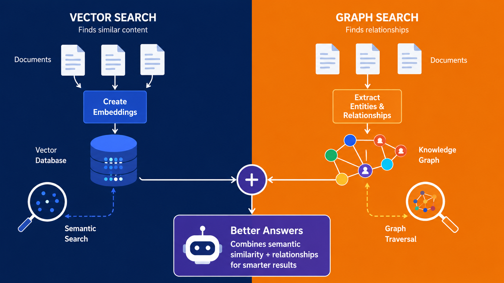

[⬅️ Back to Blogs](README.md)



If you've been exploring AI agents recently, chances are you've come across RAG (Retrieval-Augmented Generation).

A typical RAG system looks something like this:

```text
Documents
    ↓
Chunking
    ↓
Embeddings
    ↓
Vector Database
    ↓
Similarity Search
    ↓
LLM
```

This architecture has become the foundation for many AI assistants, chatbots, and knowledge-based agents.

And for good reason.

It works surprisingly well.

But as agents become more capable, many developers eventually run into the same question:

> What happens when an agent needs to understand relationships, not just retrieve similar text?

## The Limitation of Vector Search

Vector databases are excellent at finding semantically similar content.

For example, if your knowledge base contains information about:

- React
- RAG
- ChromaDB
- AI Agents

a vector search can usually retrieve the most relevant documents for a question.

However, vector search doesn't naturally understand how these concepts are connected.

Consider the following information:

```text
React is used in Project A.

Project A implements a RAG system.

The RAG system uses ChromaDB.
```

Humans immediately understand the relationship:

```text
React
  ↓
Project A
  ↓
RAG
  ↓
ChromaDB
```

A vector database mainly stores embeddings of text chunks.

It can retrieve relevant content, but it doesn't explicitly model these connections.

This becomes noticeable when users ask questions such as:

- Which projects use both React and AI?
- How is Graph RAG related to vector search?
- Which technologies are commonly used together?
- What concepts connect multiple documents?

These are relationship-based questions rather than document-based questions.

## Introducing Knowledge Graphs

A knowledge graph stores information as entities and relationships.

For example:

```text
React
   │
UsedIn
   │
Project A
   │
Implements
   │
RAG
   │
Uses
   │
ChromaDB
```

Instead of only searching documents, the system can now traverse relationships between concepts.

This makes it possible to answer more complex questions that require connecting information spread across multiple documents.

## Graph-RAG: Combining the Best of Both Worlds

One common misconception is that knowledge graphs replace vector databases.

In reality, they usually complement them.

A modern Graph-RAG architecture often looks like this:

```text
   Documents
       ↓
 ┌──────────────┐
 │ Vector Store │
 └──────────────┘
       ↓
 ┌──────────────┐
 │ Graph Store  │
 └──────────────┘
       ↓
Hybrid Retrieval
       ↓
      LLM
```

The vector database remains responsible for semantic retrieval.

The graph database provides relationship-aware retrieval.

Together they give the agent richer context before generating a response.

## Why This Matters for AI Agents

Many AI agents start as retrieval systems.

Over time, users expect them to do more than find documents.

They want agents that can:

- Connect ideas
- Discover relationships
- Explain dependencies
- Perform multi-step reasoning
- Navigate complex knowledge bases

This is where knowledge graphs become valuable.

Instead of asking:

> Which document mentions Graph RAG?

Users begin asking:

> How does Graph RAG relate to embeddings, vector search, and knowledge graphs?

Answering that effectively requires understanding relationships, not just retrieving chunks.

## When Should You Consider Graph-RAG?

A graph layer becomes increasingly useful when your knowledge base contains:

- Technical documentation
- Research notes
- Learning repositories
- Product documentation
- Enterprise knowledge bases
- Long-running project histories

The more interconnected your knowledge becomes, the more valuable relationship-aware retrieval gets.

## Final Thoughts

Vector RAG is still one of the most practical ways to build AI-powered knowledge systems.

But as AI agents become more sophisticated, retrieval alone is often not enough.

Knowledge graphs introduce a new capability: understanding how information is connected.

For developers building the next generation of AI agents, Graph-RAG is worth exploring, not as a replacement for RAG, but as a powerful enhancement that helps agents reason over knowledge rather than simply search through it.

---

 
