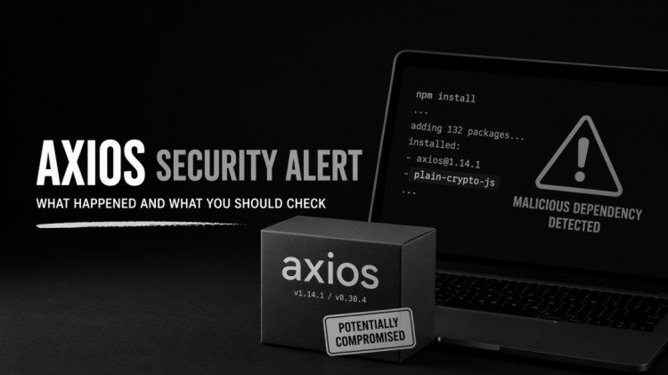

[⬅️ Back to Blogs](README.md)



If you’ve been using Axios for a while, this one might feel a bit uncomfortable.

A few days back, something weird happened. Not a bug. Not a breaking change.
A **full-blown supply chain attack**.

---

### What actually happened?

On **March 31, 2026**, attackers managed to get access to an Axios maintainer’s npm account. ([GitHub][1])

Then they did something very simple (and very dangerous):

They published **two new versions**:

- `axios@1.14.1`
- `axios@0.30.4` ([Datadog Security Labs][2])

At first glance, everything looked normal. No suspicious code changes. No red flags.

But under the hood?

They quietly added a dependency:

```
plain-crypto-js
```

And that’s where things go downhill.

---

### The scary part

This wasn’t just a harmless package.

It was designed to install a **remote access trojan (RAT)** on your system. ([Datadog Security Labs][2])

Meaning:

- It could run on **Mac, Windows, Linux**
- It could connect to a remote server
- It could potentially give attackers access to your machine

And the worst part?

It runs during `npm install`.

So yeah… just installing dependencies was enough.

---

### “But I didn’t update Axios…”

You might still be affected.

If your project:

- didn’t pin versions properly
- or ran a fresh install during that ~**3 hour window**

…it could have pulled the compromised version automatically. ([Datadog Security Labs][2])

That’s the nature of supply chain attacks.
They don’t knock on the door. They just… walk in.

---

### Why this one hits differently

What makes this incident interesting (and a bit scary):

- No change in actual Axios source code
- Only `package.json` was modified
- Malicious dependency wasn’t even used anywhere

Basically:

> Everything looked clean… but wasn’t.

That’s some next-level subtlety.

---

### Quick checklist (just in case)

If you want to sleep peacefully tonight:

- Check your lock files for:

  - `axios@1.14.1`
  - `axios@0.30.4`
  - `plain-crypto-js`

- If found → assume compromise
- Rotate tokens, API keys, credentials
- Reinstall from a safe version (`1.14.0` or below) ([GitHub][1])

---

### My personal takeaway

This wasn’t about Axios being “bad”.

This was about:

- trust
- ecosystem scale
- and how fragile open-source pipelines can be

Axios has **100M+ weekly downloads**.

One small breach → massive blast radius.

---

### References

- GitHub Issue (Postmortem): [https://github.com/axios/axios/issues/10636](https://github.com/axios/axios/issues/10636) ([GitHub][1])
- Datadog Security Analysis: [https://securitylabs.datadoghq.com/articles/axios-npm-supply-chain-compromise/](https://securitylabs.datadoghq.com/articles/axios-npm-supply-chain-compromise/) ([Datadog Security Labs][2])
- Sophos Report: [https://www.sophos.com/en-us/blog/axios-npm-package-compromised-to-deploy-malware](https://www.sophos.com/en-us/blog/axios-npm-package-compromised-to-deploy-malware) ([SOPHOS][3])

---

If you missed this news earlier, now you know.

And maybe… pin your dependencies today

[1]: https://github.com/axios/axios/issues/10636?utm_source=chatgpt.com 'Post Mortem: axios npm supply chain compromise #10636'
[2]: https://securitylabs.datadoghq.com/articles/axios-npm-supply-chain-compromise/?utm_source=chatgpt.com 'Compromised axios npm package delivers cross-platform ...'
[3]: https://www.sophos.com/en-us/blog/axios-npm-package-compromised-to-deploy-malware?utm_source=chatgpt.com 'Axios npm package compromised to deploy malware'

---


