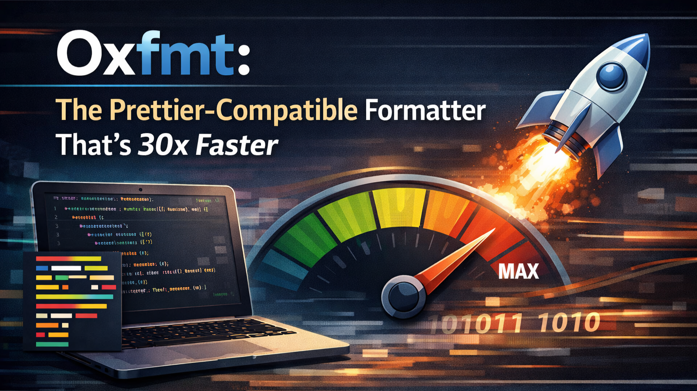

[⬅️ Back to Blogs](../README.md)



Remember [Part 1](./Oxlint_JS_Linter_Thats_Actually_Fast_Enough_to_Matter.md) where we talked about Oxlint being stupidly fast? Well, buckle up because Oxfmt (the formatter) is even more ridiculous.

We're talking 30x faster than Prettier. Not a typo. Thirty times.

But speed isn't everything. Prettier works. It's stable. It's everywhere. So the real question isn't "is Oxfmt fast?" it's "is it fast enough to justify the risk of switching?"

Let's find out.

## What Is Oxfmt?

Oxfmt is a code formatter built by the same VoidZero team that made Oxlint. Written in Rust, runs on the Oxc parser (same one Oxlint uses), and targets 95%+ compatibility with Prettier.

Key phrase: **targets compatibility**. Not "reinvents formatting" like Biome. Not "has its own opinions" like dprint. Oxfmt's goal is to be Prettier, but faster.

[Announced in December 2025](https://oxc.rs/blog/2025-12-01-oxfmt-alpha), currently in alpha. Early, but with receipts.

## The Performance Numbers (With Sources)

All numbers from [Oxc's official formatter benchmark repo](https://github.com/oxc-project/bench-formatter).

**Large single file (TypeScript compiler's parser.ts, ~540KB):**

```
oxfmt:                  104ms
Biome:                  136ms (1.3x slower)
prettier+oxc-parser:    710ms (6.8x slower)
prettier (default):     1.04s (10x slower)
```

**Mixed repository (Storybook):**

```
oxfmt:              16.6s
prettier+oxc:       40.2s (2.4x slower)
```

**Full features (Continue repository):**

```
oxfmt:              9.2s
prettier+oxc:       56.8s (6.2x slower)
```

**Memory usage (Outline benchmark):**

```
prettier:       223.9 MB
oxfmt:          152.9 MB
Biome:          62.2 MB  ← Biome wins here
```

Worth noting: Biome is significantly more memory-efficient. Oxfmt is faster, but Biome is leaner. [Official benchmarks](https://oxc.rs/docs/guide/benchmarks) put Oxfmt at roughly **30x faster than Prettier** and **3x faster than Biome** on initial runs without cache.

## But Is It Actually Compatible?

This is the million-dollar question. If Oxfmt formats your code differently, migration becomes a nightmare of diffs.

Good news: [Oxfmt passes ~95% of Prettier's JS/TS test suite](https://oxc.rs/blog/2025-12-01-oxfmt-alpha). The remaining 5%? Some of it is intentional.

**Example — array formatting consistency:**

```javascript
// Prettier (inconsistent)
const longer = [
  'item1',
  'item2',
  'item3', // breaks despite fitting
];

// Oxfmt (consistent)
const longer = ['item1', 'item2', 'item3']; // stays inline if it fits
```

The team is even [submitting PRs to Prettier](https://voidzero.dev/posts/announcing-oxfmt-alpha) to converge on these edge cases, some landed in Prettier 3.7.

**⚠️ Critical gotcha:** Oxfmt defaults to `printWidth: 100`. Prettier defaults to `80`. Migrate without setting this and you'll get massive diffs everywhere.

```json
// .oxfmtrc.jsonc — set this FIRST
{
  "$schema": "./node_modules/oxfmt/configuration_schema.json",
  "printWidth": 80
}
```

## Feature Comparison

| Feature                    | Oxfmt (Alpha) | Prettier 3.7 | Biome 2.0   |
| -------------------------- | ------------- | ------------ | ----------- |
| **Speed**                  | 30x faster    | Baseline     | 3x faster   |
| **Prettier compatibility** | 95%+          | 100%         | ~70%        |
| **JS/TS/CSS/HTML**         | ✅            | ✅           | ✅          |
| **Tailwind class sorting** | Built-in ✅   | Plugin       | ❌          |
| **Import sorting**         | Coming        | Plugin       | Built-in ✅ |
| **Vue/Svelte/Astro**       | Roadmap       | Plugins      | ❌          |
| **Plugin support**         | Roadmap       | ✅           | ❌          |
| **Memory usage**           | 152 MB        | 224 MB       | 62 MB       |
| **Production ready**       | No (alpha)    | Yes          | Yes         |

Oxfmt's built-in Tailwind class sorting is a big deal if you're on Tailwind, no `prettier-plugin-tailwindcss` needed. But no Vue/Svelte/Astro support yet, and no plugin system. Both are on the beta roadmap.

## Migration Strategies

### Option 1: Full Replace

**Best for:** JS/TS-only projects, no Prettier plugins, willing to be early adopters

```bash
npm install -D oxfmt
npx oxfmt --migrate=prettier  # Auto-converts your Prettier config
npx oxfmt .
```

**Trade-offs:** 30x faster, built-in Tailwind sorting, 95% compatible, but alpha bugs exist, no plugins, no Vue/Svelte formatters.

### Option 2: Hybrid (Local Speed, CI Safety)

**Best for:** Teams that want fast local formatting but aren't ready to commit

```json
{
  "scripts": {
    "format": "oxfmt .",
    "format:ci": "prettier --check ."
  }
}
```

Run Oxfmt locally for instant feedback. Keep Prettier in CI as a safety net. Slightly wasteful running both, but it de-risks the migration considerably.

### Option 3: Wait for Beta (Q1 2026)

Honestly the right call for most teams. [The team has been upfront](https://voidzero.dev/posts/announcing-oxfmt-alpha): _"Oxfmt is in alpha and may not suit complex setups."_

Beta is targeting Q1 2026 with import sorting, Vue/Svelte/Astro support, and a plugin system. If you're not hitting CI pain right now, wait.

## Common Pitfalls

**`printWidth` mismatch:** The single biggest migration trap. Always set `printWidth: 80` explicitly if migrating from Prettier.

**Prettier plugins:** `prettier-plugin-organize-imports`, `@trivago/prettier-plugin-sort-imports`, and similar won't work. Plugin system is on the beta roadmap.

**Vue/Svelte/Astro files:** Oxfmt skips them silently. Keep Prettier for those files until framework support lands.

## When Should You Use It?

**Choose Oxfmt if:**

- You need maximum speed (30x faster)
- You use Tailwind heavily (built-in class sorting, no plugin needed)
- You only format JS/TS/CSS/HTML
- You're okay with alpha software and willing to file issues

**Stick with Prettier if:**

- You rely on plugins (import sorters, framework formatters)
- You need proven stability
- Your pre-commit hooks run on thousands of files daily (alpha bugs = blocked commits)

**Consider Biome if:**

- You want one unified tool for linting + formatting
- Memory efficiency matters to you
- You need stable Rust-based tooling today

## The Bigger Picture: Full Oxc Stack

If you go all-in on Oxc, your entire pipeline shares the same parser. Lint and format without parsing your code twice.

```json
// package.json
{
  "scripts": {
    "lint": "oxlint",
    "format": "oxfmt",
    "check": "oxlint && oxfmt --check"
  }
}
```

VoidZero's vision: _"One toolchain for parse, lint, format, transform, bundle."_

Not fully there yet, Oxfmt is alpha, Rolldown is still in development. But the direction is clear.

## The Honest Take

Oxfmt is impressive. 30x faster than Prettier is real. Built-in Tailwind sorting removes a dependency. 95% compatibility makes migration feasible without a giant diff.

But it's alpha. If you're on a greenfield project and comfortable filing GitHub issues, try it. If you're running a production app with dozens of engineers, wait for beta. If Prettier works fine and CI isn't painful, there's genuinely no reason to change. Being boring with tooling is underrated.

The best formatter is the one that gets out of your way.

---

**Try it yourself:**

- [Oxfmt docs](https://oxc.rs/docs/guide/usage/formatter)
- [Official benchmarks](https://github.com/oxc-project/bench-formatter)
- [Alpha announcement](https://oxc.rs/blog/2025-12-01-oxfmt-alpha)
- [Migration guide](https://oxc.rs/docs/guide/usage/formatter/migrate-from-prettier)

**Questions? Hit bugs? Found edge cases?** Drop them in the comments, community feedback shapes these tools early on.

**Missed Part 1?** Go read the [Oxlint deep dive](./Oxlint_JS_Linter_Thats_Actually_Fast_Enough_to_Matter.md) on why it's 50-100x faster than ESLint and when you should actually care.

---

   
